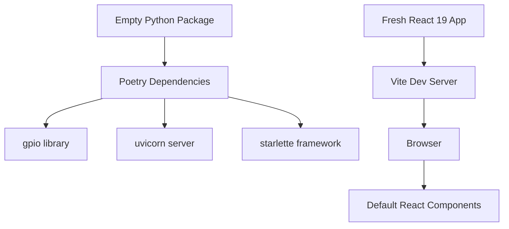
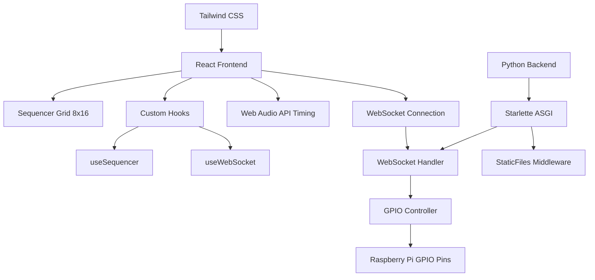
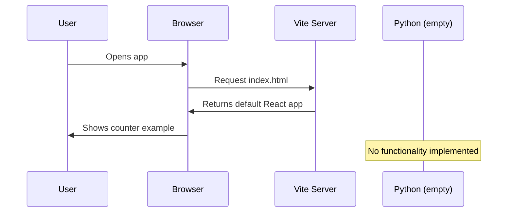
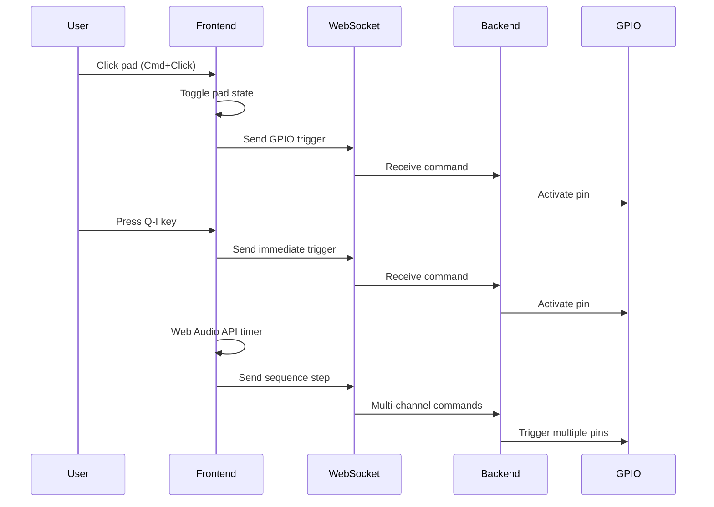
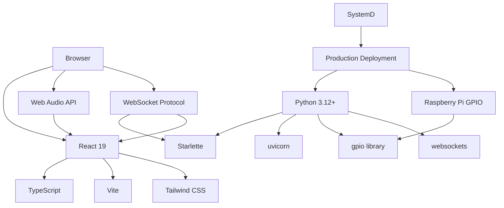

# Technical Implementation Blueprint: 16-step sequencer web

## 1. Current vs Target Analysis

### 1.1 Current System Architecture


### 1.2 Target System Architecture


### 1.3 Current Data & Logic Flow


### 1.4 Target Data & Logic Flow


### 1.5 Summary of Improvements
- **Real-time Hardware Control** – Direct GPIO integration with Raspberry Pi for music production
- **Professional Timing Engine** – Web Audio API provides millisecond-precision sequencing
- **Modular Component Architecture** – Reusable Pad components with clean hook separation
- **WebSocket Real-time Communication** – Low-latency bidirectional communication for immediate response
- **Responsive Grid Interface** – Tailwind CSS for modern, mobile-friendly sequencer interface

## 2. System Components

### 2.1 Frontend Components
- **App** – Main application container with keyboard event handling
- **SequencerGrid** – 8×16 grid layout container component
- **Pad** – Reusable interactive pad component with Cmd+click handling
- **Controls** – BPM input, start/stop buttons, and sequence controls
- **useSequencer** – Custom hook managing sequence state and playback logic
- **useWebSocket** – Custom hook handling real-time GPIO communication
- **AudioScheduler** – Web Audio API integration for precise timing

### 2.2 Backend Components
- **WebSocketHandler** – Manages real-time client connections and GPIO commands
- **GPIOController** – Hardware abstraction layer with channel-to-pin mapping
- **StaticFileServer** – Serves React production build and assets
- **ChannelMapper** – Simple dictionary mapping sequencer channels to GPIO pin IDs
- **CommandProcessor** – Processes simultaneous multi-channel GPIO triggers

## 3. Data Models

### 3.1 Database Schema
```sql
-- No persistent database required - stateless operation
-- All sequence data managed in frontend state
-- Configuration stored in simple JSON/environment variables

-- GPIO Pin Mapping (configuration file)
{
  "channel_mapping": {
    "0": 18,  -- Channel 0 -> GPIO Pin 18
    "1": 19,  -- Channel 1 -> GPIO Pin 19
    "2": 20,  -- Channel 2 -> GPIO Pin 20
    "3": 21,  -- Channel 3 -> GPIO Pin 21
    "4": 22,  -- Channel 4 -> GPIO Pin 22
    "5": 23,  -- Channel 5 -> GPIO Pin 23
    "6": 24,  -- Channel 6 -> GPIO Pin 24
    "7": 25   -- Channel 7 -> GPIO Pin 25
  }
}

-- Frontend State Structure (TypeScript interfaces)
interface SequencerState {
  grid: boolean[][];     -- 8x16 grid of pad states
  isPlaying: boolean;    -- Playback state
  currentStep: number;   -- Current column (0-15)
  bpm: number;          -- Beats per minute (80-200)
}

interface GPIOCommand {
  channels: number[];    -- Array of channel IDs to trigger
  duration: number;      -- Trigger duration in milliseconds
}
```

## 4. API Specifications

### 4.1 Endpoints
- **WebSocket /ws** – Real-time bidirectional communication for GPIO control
  - **Send: gpio_trigger** – `{channels: [0,1,2], duration: 100}`
  - **Send: immediate_trigger** – `{channel: 0, duration: 50}` (for keyboard/direct pad clicks)
  - **Receive: connection_status** – `{connected: true, gpio_available: true}`
  - **Receive: error** – `{error: "GPIO pin access denied", channel: 0}`

- **GET /** – Serves React production build (index.html)
- **GET /assets/** – Static files (JS, CSS, images) via Starlette StaticFiles
- **GET /health** – Basic health check endpoint returning server status

## 5. Implementation Phases

### Phase 1 – Core Infrastructure Setup
- [ ] Configure Tailwind CSS in React project
- [ ] Create basic SequencerGrid and Pad components
- [ ] Implement useSequencer hook with grid state management
- [ ] Set up Starlette backend with WebSocket support
- [ ] Create basic GPIO controller with channel mapping

### Phase 2 – Real-time Communication
- [ ] Implement useWebSocket hook in frontend
- [ ] Create WebSocket handler in Python backend
- [ ] Test basic pad-to-GPIO communication flow
- [ ] Add simultaneous multi-channel trigger support
- [ ] Implement error handling and connection status

### Phase 3 – Timing and Playback Engine
- [ ] Integrate Web Audio API for precise timing
- [ ] Implement sequence playback with visual feedback
- [ ] Add BPM configuration and controls
- [ ] Create column highlighting during playback
- [ ] Test timing accuracy across different BPM settings

### Phase 4 – User Interactions
- [ ] Add keyboard event handling (Q-I keys) at app level
- [ ] Implement Cmd+click modifier detection in Pad components
- [ ] Create start/stop sequence controls
- [ ] Add immediate GPIO triggering for live play
- [ ] Implement visual feedback for all interactions

### Phase 5 – Production Deployment
- [ ] Configure Starlette StaticFiles for React build
- [ ] Set up Raspberry Pi GPIO permissions and testing
- [ ] Create production build scripts and deployment
- [ ] Add basic error logging and monitoring
- [ ] Test complete system on target hardware

## 6. Technical Risks & Mitigation

| Risk | Mitigation |
| --- | --- |
| GPIO Permission Issues on Pi | Run application with proper sudo/gpio group permissions, provide clear setup documentation |
| WebSocket Connection Drops | Implement automatic reconnection logic in useWebSocket hook with exponential backoff |
| Timing Accuracy Degradation | Use Web Audio API's high-resolution timer instead of setTimeout, test across browsers |
| Raspberry Pi Performance Limits | Keep backend minimal, frontend handles all timing calculations, single bundle approach |
| Browser Audio Context Restrictions | Require user interaction before starting audio context, provide clear UI prompts |
| GPIO Hardware Conflicts | Simple channel mapping allows easy reconfiguration, document pin usage clearly |

## 7. Testing Strategy

### 7.1 Unit Testing
- **Frontend**: Jest/Vitest for custom hooks (useSequencer, useWebSocket)
- **Component Testing**: React Testing Library for Pad and Grid components
- **Backend**: pytest for GPIO controller and WebSocket handler logic
- **Mock Strategy**: Mock GPIO library for development/testing environments

### 7.2 Integration Testing
- **WebSocket Communication**: Test full message flow from frontend to GPIO
- **Timing Accuracy**: Measure actual vs expected timing with Web Audio API
- **Hardware Integration**: GPIO pin activation testing on actual Raspberry Pi
- **Browser Compatibility**: Test WebSocket and Web Audio API across Chrome, Firefox, Safari

## 8. Deployment Considerations

**Environment Variables:**
- `GPIO_CHANNEL_MAPPING`: JSON string defining channel-to-pin mapping
- `PORT`: Server port (default: 8000)
- `HOST`: Server host (default: 0.0.0.0 for Pi access)

**Raspberry Pi Setup:**
- Add user to `gpio` group for hardware access
- Install Python dependencies via Poetry
- Build React frontend for production
- Configure systemd service for auto-start

**Development vs Production:**
- Mock GPIO library in development environment
- Use Vite dev server for frontend development
- Production serves static files via Starlette

**Monitoring & Observability:**
- Basic connection logging for WebSocket events
- GPIO command success/failure tracking
- Simple health check endpoint for system monitoring

---

## Annex A – Dependency Map
